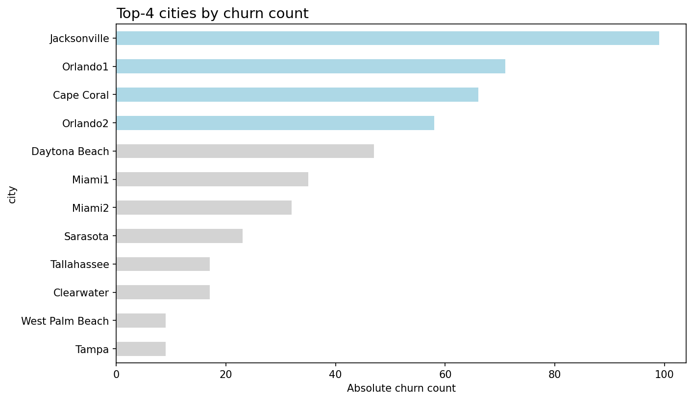

# Telefonica Churn

**Which cities and which customers should a telecom target with two retention campaigns — based on 3,333 customers from a Florida market entry.**


---

## TL;DR

**Scenario:** Teleconfia enters the Florida market with a subsidized first year. Some customers churn anyway. Two retention campaigns need targets: a poster campaign for the worst city districts, and individual outreach for at-risk customers.

- **Baseline churn rate: 14.49%** across 3,333 customers (16 fully-empty rows dropped from the raw 3,349).
- **4 cities drive 60.9% of all churn:** Jacksonville (29.82%), Orlando1 (23.67%), Cape Coral (21.78%), Orlando2 (19.08%) — the poster-campaign targets.
- **`international_plan` is the strongest individual-contact signal:** 42.4% churn rate vs. 11.5% without it — 323 customers.
- **`customer_service_calls` is a clean early-warning indicator:** churn rate jumps from ~10% to 45.8% at the 4th call — contact threshold set at 3 calls (696 customers).
- **Logistic regression on `total_day_minutes`** gives a statistically clean 50%-probability threshold (350.74 minutes) but is weak alone (pseudo-R² 0.052, only 4 customers above it) — useful only as a secondary criterion.
- **954 of 3,333 customers** trigger at least one of the three risk indicators.


*Jacksonville, Orlando1, Cape Coral and Orlando2 — the four city districts selected for the poster campaign.*

---

## Where to start

| You are a… | Start here |
| :--- | :--- |
| New here / quick overview | [Hub](public/index.html) — key figures + navigation to all views |
| Recruiter (30s) | [Overview](public/overview.html) — results and recommendations, no methodology |
| Analyst (10 min) | [StoryView](public/storyview.html) — the full path from raw data to campaign targets |
| Technically interested | [TechView](public/techview.html) — cleaning, indicator types, regression, limitations |
| Want the code | [`00_introduction.ipynb`](notebooks/00_introduction.ipynb) → [`03_analysis.ipynb`](notebooks/03_analysis.ipynb) → [`04_insights.ipynb`](notebooks/04_insights.ipynb) |

---

## Problem Statement

Teleconfia, a telecom provider, is testing the US market with Florida as its first pilot region. New customers got a discounted first year in the Teleconfia network — not all of them stayed. This churn is to be countered with two campaigns: a **poster campaign** in the city districts with the highest churn, and **individual outreach** to customers who are likely to leave, offering special terms before they do.

**Guiding question:** Which data columns actually indicate churn risk, and where should the threshold for contacting a customer be set? The float-column threshold is determined with a logistic regression rather than a rule of thumb.

---

## Dataset

| | |
| :--- | :--- |
| Source | `telco_churn.db` (SQLite) — StackFuel capstone project (Module 2, Chapter 8) |
| Tables | `churn_data` (3,349 rows × 17 columns) + `cities` (12 city districts, 1:1 to area codes) |
| Joined dataset | 3,349 rows × 18 columns (`local_area_code` = `cities.area_code`) |
| Cleaned dataset | 3,333 rows (16 fully-empty rows dropped) |
| Granularity | One row per customer |
| Period | Cross-sectional snapshot — no date column |

**Known issues (found during content audit, both fixed in [`02_preparation.ipynb`](notebooks/02_preparation.ipynb)):**

- 37 rows had **negative `customer_service_calls`** values (-1, -2) in the raw database — impossible for a call counter. Clipped to 0.
- 4 additional columns had partial NaNs beyond the 16 fully-empty rows (`number_vmail_messages`, `total_day_calls`, `total_eve_calls`, `total_night_calls`) — filled with domain-appropriate values (0 or median).
- `Orlando1`/`Orlando2` and `Miami1`/`Miami2` are separate entries for the same metro area (different area codes) — relevant if a campaign is planned per metro region rather than per area code.

---

## Approach

### Data Engineering
- SQL join of `churn_data` + `cities` via SQLAlchemy → single DataFrame
- Cleaning: drop fully-empty rows, domain-appropriate NaN fills, clip implausible negative values, `yes`/`no` → `1`/`0`, dtype downcasting (67.6% memory reduction)

### Data Analysis
- City ranking by absolute churn count → top-4 targets for the poster campaign
- Three indicator candidates evaluated independently, each against the full dataset (not pre-filtered by the other two): one categorical (`international_plan`), one integer (`customer_service_calls`, threshold from the churn-rate inflection point), one float (`total_day_minutes`, threshold from a logistic regression at 50% churn probability)
- No train/test split — the goal is business-targeting thresholds on the full dataset, not a model evaluated for generalization. See [`02_preparation.ipynb`](notebooks/02_preparation.ipynb) for the reasoning.

---

## Results

| Indicator | Threshold | Customers affected | Strength |
| :--- | :--- | :---: | :--- |
| City (poster campaign) | Top-4 by churn count | 60.9% of all churn | — |
| `international_plan` | `== 1` | 323 | Strong (42.4% vs. 11.5% churn rate) |
| `customer_service_calls` | `>= 3` | 696 | Strong (churn rate ×4.5 at the inflection point) |
| `total_day_minutes` | `>= 350.74` (logit) | 4 | Weak alone (pseudo-R² 0.052) — secondary criterion |

Combined, the three individual-contact indicators reach 954 of 3,333 customers (at least one indicator matched). Full recommendations with priority/effort → [`04_insights.ipynb`](notebooks/04_insights.ipynb).

---

## Notebooks

| # | Notebook | Content |
| :--- | :--- | :--- |
| 00 | [`00_introduction.ipynb`](notebooks/00_introduction.ipynb) | Scenario, data dictionary, business question |
| 01 | [`01_exploration.ipynb`](notebooks/01_exploration.ipynb) | SQL load, EDA, plausibility checks (found the negative-value data issue) |
| 02 | [`02_preparation.ipynb`](notebooks/02_preparation.ipynb) | Cleaning, dtype optimization, export to `data/processed/` |
| 03 | [`03_analysis.ipynb`](notebooks/03_analysis.ipynb) | City ranking + all three indicator analyses, incl. logistic regression |
| 04 | [`04_insights.ipynb`](notebooks/04_insights.ipynb) | Executive summary, key charts, recommendations |

---

## Tech Stack

| Category | Tools |
| :--- | :--- |
| Language | Python 3.10 |
| Data | pandas, SQLAlchemy (SQLite) |
| Analysis | statsmodels (logistic regression) |
| Visualization | Matplotlib, Seaborn |
| Toolkit | [wgnd-toolkit](https://github.com/kaywiegand/wgnd-toolkit) — shared EDA helpers (`wgnd.inspect`) |
| Notebooks | JupyterLab |
| Packaging | uv, pyproject.toml |

---

## Setup

```bash
uv venv && source .venv/bin/activate
uv pip install -e ".[da]"
jupyter lab
```

Open `notebooks/00_introduction.ipynb` and read in order. Raw data (`telco_churn.db`) is excluded from the repo via `.gitignore`.

---

## Reports & Artifacts

| Artifact | Path | Content |
| :--- | :--- | :--- |
| Hub | [`public/index.html`](public/index.html) | Key figures, project summary, navigation to the three views |
| Overview | [`public/overview.html`](public/overview.html) | 7 slides — results and recommendations, no methodology |
| StoryView | [`public/storyview.html`](public/storyview.html) | 15 slides — the complete project narrative |
| TechView | [`public/techview.html`](public/techview.html) | 9 slides — cleaning, indicator types, regression, limitations |
| Charts | [`public/img/`](public/img/) | City ranking, international plan, customer service calls, logistic regression |
| Slide registry | [`public/md/slides.yaml`](public/md/slides.yaml) | Single source of truth for all three views |

All three views are generated from `public/md/slides.yaml` via `make portfolio`. Never edit the
generated `public/*.html` directly — the previous state is archived under `public/archive/`.

---

## Author

**Kay Alexander Wiegand**
Senior Consultant · Data Scientist
[LinkedIn](https://de.linkedin.com/in/kaywiegand) · [GitHub](https://github.com/kaywiegand)
